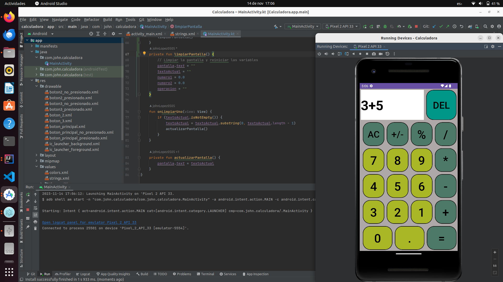

# Calculadora Básica en Kotlin

La siguiente es una implementación simple de una calculadora básica en Kotlin para Android.

## Descripción

La calculadora realiza operaciones de suma, resta, multiplicación y división entre dos números ingresados por el usuario.

## Clases y Variables

- `MainActivity`: La actividad principal que contiene la lógica de la calculadora.

```kotlin

class MainActivity : AppCompatActivity() {
private var numero1: Double = 0.0
private var numero2: Double = 0.0
private var operacion: String = ""
private var textoActual: String = ""
private lateinit var boton : Button

    private lateinit var pantalla: TextView
    
    override fun onCreate(savedInstanceState: Bundle?) {
        super.onCreate(savedInstanceState)
        setContentView(R.layout.activity_main)

        pantalla = findViewById(R.id.txt_pantalla)

    }

    fun onNumeroClick(view: View) {
        boton = view as Button
        if (!(boton.text.matches(Regex("=")))){
            textoActual += boton.text
            actualizarPantalla()
        }
    }
    
    private fun tomarDatos(){
        var datos = textoActual
        var token : Array<String> = datos.toString().split("[+\\-*/]".toRegex()).toTypedArray()
        numero1 = token[0].toDouble()
        numero2 = token[1].toDouble()
        val coincidencia = "[+\\-/*]".toRegex()
        textoActual.forEach {
            if (it.toString().matches(coincidencia)){
                operacion = it.toString()
            }
        }
    }
    
    fun onIgualClick(view: View) {
        tomarDatos()
        // Realizar la operación y mostrar el resultado en la pantalla
        when (operacion) {
            "+" -> pantalla.text = (numero1 + numero2).toString()
            "-" -> pantalla.text = (numero1 - numero2).toString()
            "*" -> pantalla.text = (numero1 * numero2).toString()
            "/" -> {
                if (numero2 != 0.0) {
                    pantalla.text = (numero1 / numero2).toString()
                } else {
                    pantalla.text = "Error"
                }
            }
        }
    }

    fun onLimpiarClick(view: View) {
        limpiarPantalla()
    }
    private fun limpiarPantalla() {
        // Limpiar la pantalla y reiniciar las variables
        pantalla.text = ""
        textoActual = ""
        numero1 = 0.0
        numero2 = 0.0
        operacion = ""
    }

    fun onLimpiarUno(view: View) {
        if (textoActual.isNotEmpty()) {
            textoActual = textoActual.substring(0, textoActual.length - 1)
            actualizarPantalla()
        }
    }

    private fun actualizarPantalla() {
        pantalla.text = textoActual
    }
}
```

Variables miembro:
- `numero1`: Primer número para la operación.
- `numero2`: Segundo número para la operación.
- `operacion`: Operación a realizar (suma, resta, multiplicación, división).
- `textoActual`: Almacena la expresión actual ingresada por el usuario.
- `boton`: Referencia al botón presionado.
- `pantalla`: Referencia al TextView que muestra el resultado en la interfaz de usuario.

## Métodos

- `onCreate`: Método de inicio de la actividad que configura la interfaz de usuario.

- `onNumeroClick`: Método llamado al hacer clic en un botón numérico. Actualiza la expresión actual y la pantalla.

- `tomarDatos`: Método para extraer los datos (números y operación) de la expresión actual.

- `onIgualClick`: Método llamado al hacer clic en el botón "=" para realizar la operación y mostrar el resultado.

- `onLimpiarClick`: Método llamado al hacer clic en el botón de limpiar para reiniciar la calculadora.

- `limpiarPantalla`: Método privado para limpiar la pantalla y reiniciar las variables.

- `onLimpiarUno`: Método llamado al hacer clic en el botón de eliminar un carácter de la expresión actual.

- `actualizarPantalla`: Método privado para actualizar la pantalla con la expresión actual.

## Uso

1. Ingrese números utilizando los botones numéricos.
2. Seleccione la operación deseada.
3. Presione "=" para ver el resultado.
4. Puede borrar un carácter a la vez o limpiar la expresión.

**Nota:** La división por cero mostrará "Error" en la pantalla.

## Imagen de ejecucion:



___

[**REPOSITORIO: https://github.com/johnlopez0505/calculadora.git**](https://github.com/johnlopez0505/calculadora.git)


